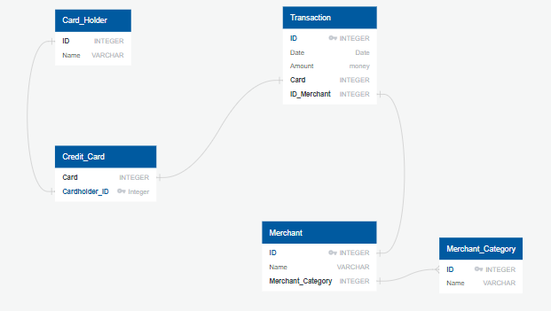
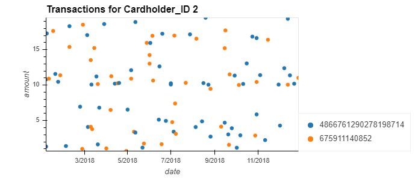
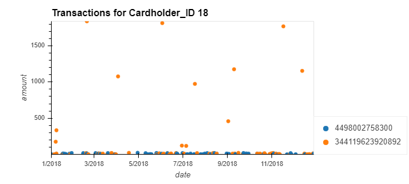

# Using-SQL-To-Find-Fraud
Using SQL to analyze historical credit card transactions 

In this repository We will take a record of credit card transactions and use SQL to see if we can discover fraud in them. We will complete three main tasks in this repository...

* Data Modeling
    - Fist, we will define a database model to store the credit card transactions data and create a new PostgreSQL database using our model.
    - We will create an ERD (Entity Relationship Diagram) where we will visualize the datasets we have.

 This is the ERD that we made with [Quick Database DIagrams](https://www.quickdatabasediagrams.com)

 

* Data Engineering
    - Then we will create a database schema on PostgreSQL and populate the database.
    - This we consist of a database schema for each of the tables and the relationships. We wil specify data types, primary keys, foreign keys, and any other constraints.

* Data Analysis
    - We will analyze the data to find possible fraudulent activity. A report will follow answering:

         - How can you isolate the transactions of each cardholder?
         - Consider the time period 7:00 am to 9:00 am
            - What are the top 100 highest transactions during this period?
            - Do you see any fraudulent or anamolous transactions? Why?

     - Some fraudsters hack a credit card by making several small payments (generally less than $2.00), which are typically ignored by cardholders. Count the transactions that are less than $2.00 per cardholder. Is there any evidence to suggest that a credit card has been hacked? Explain your rationale.

     - What are the top 5 merchants prone to being hacked using small transactions?

     - Once you have a query that can be reused, create a view for each of the previous queries.

     After all this I will create a visual data analysis of fraudulent transactions using Pandas, Plotly, hvPLot and SQLAlchemy.

    - Verify if there are any fraudulent transactions in the history of two of the most important customers of the firm. For privacy reasons, you only know that their cardholders' IDs are 18 and 2.

After looking through the data from multiple tables, we pulled certain information from two tables (transaction & credit_card) to take a look at and instances of possible fraud.
## Cardholders ID #2 
For Cardholder ID #2, we noticed pretty regular spending. All of the purchases were within a certain range and made at evenly distributed times.

## Cardholder ID #18
Cardholder ID# 18 had different spending habits. Although there were similar smaller purchases, there were also periodic purchases that were vastly outside the standard deviation. These purchases occurred once a month and always on one particular credit card. This is definately something that should be looked into further for possible fraud.

        - Using hvPlot, create a line plot representing the time series of transactions over the course of the year for each cardholder. In order to compare the patterns of both cardholders, create a line plot containing both lines.

            - What difference do you observe between the consumption patterns? Does the difference suggest a fraudulent transaction? Explain your rationale.

     - The CEO of the biggest customer of the firm suspects that someone has used her corporate credit card without authorization in the first quarter of 2018 to pay quite expensive restaurant bills. You are asked to find any anomalous transactions during that period.
     - Using Plotly Express, create a series of six box plots, one for each month, in order to identify how many outliers per month for cardholder ID 25.
     - Do you notice any anomalies? Describe your observations and conclusions.
